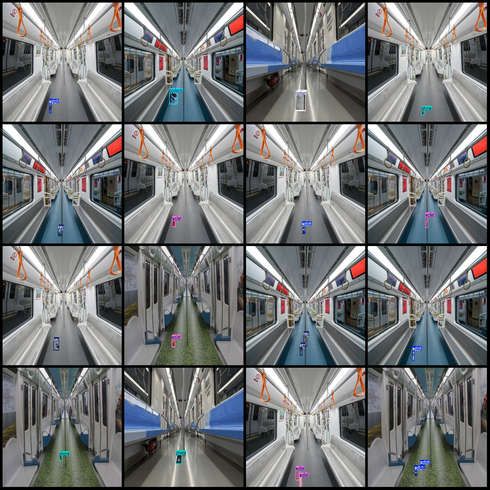
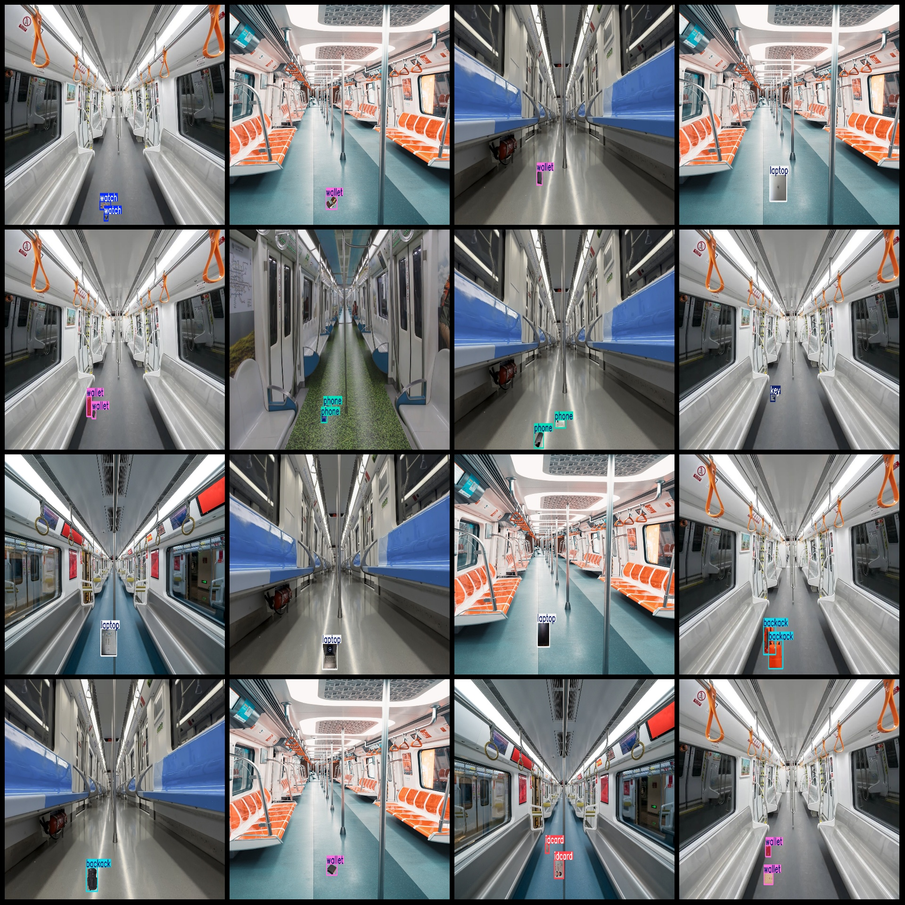

# Subway Missing Object Detection Dataset VOC+YOLO Format: 700 Images, 7 Categories

The Pascal VOC format is a commonly used dataset format for object detection tasks. It consists of a set of images labeled with bounding box coordinates and class labels, along with the corresponding XML file format. The YOLO format is another popular dataset format for object detection, which consists of image files, their corresponding annotations, and the XML file format.

To provide you with the dataset format you mentioned, I will provide you with a sample dataset in Pascal VOC format and YOLO format. However, please note that this is just an example and the actual dataset may vary depending on the specific dataset you are referring to.

Pascal VOC Format:
```
image_name1.jpg
class_label1.xml
class_label2.xml
...
```

Yolo Format:
```
image_name1.jpg
annotation_box1.xml
annotation_class1.xml
annotation_class2.xml
...
```

In the above examples, "image_name" represents the name of the image file, "class_label" represents the label of the object in the image, "annotation_box" represents the bounding box coordinates in the image, and "annotation_class" represents the class label of the object in the image. You can replace these placeholders with your actual dataset information.
Number of images (number of jpg files): 700
Number of XML files: 700
700
Labeled as a category with 7.
["backack", "idcard", "key", "laptop", "phone", "wallet", "watch"]
boxes per class:   
backack (backpack) box count = 159  
idcard (ID card) frame count = 152
Key (key) Frames = 149
Laptop Frame Count = 154
Phone (phone) Frames = 141
Wallet Frames = 167
Watch frame count = 154
Total Frames: 1076
Image resolution: 1920x1080
Use annotation tool: labelImg
Annotation Rule: Draw a rectangle around the class.
Important Notes: There are no special statements at this time.
Special Statement: This dataset does not guarantee the accuracy of the trained model or weight file.
Image Preview:
## Images





Here is a pay link on Stripe ( https://buy.stripe.com/3cs8yP7sY87d0vu9AB ). Please contact me lonlonago@foxmail.com after funding $89, and I will send you a complete data files , thank you!

